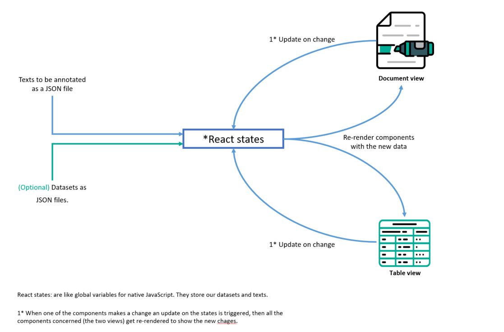
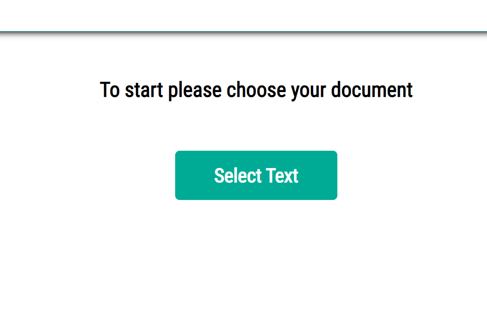
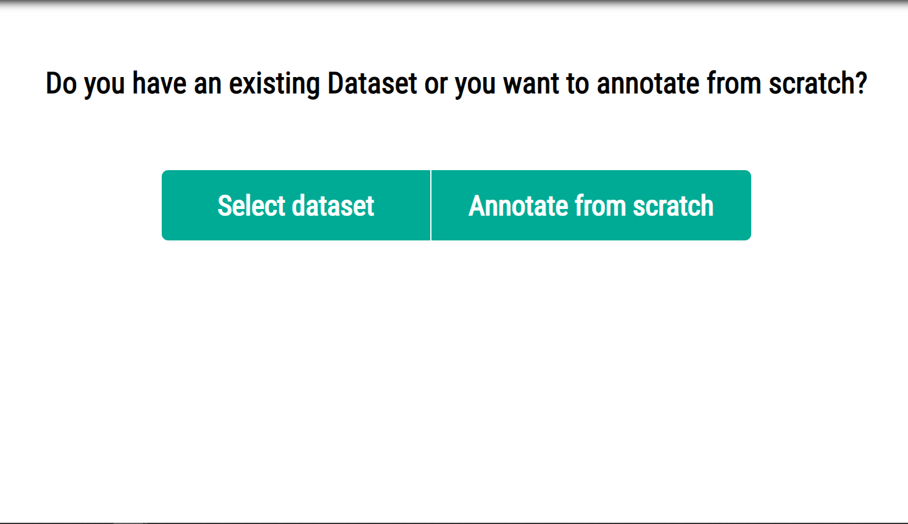
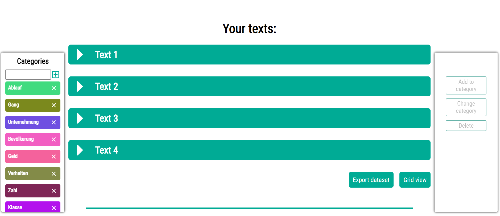
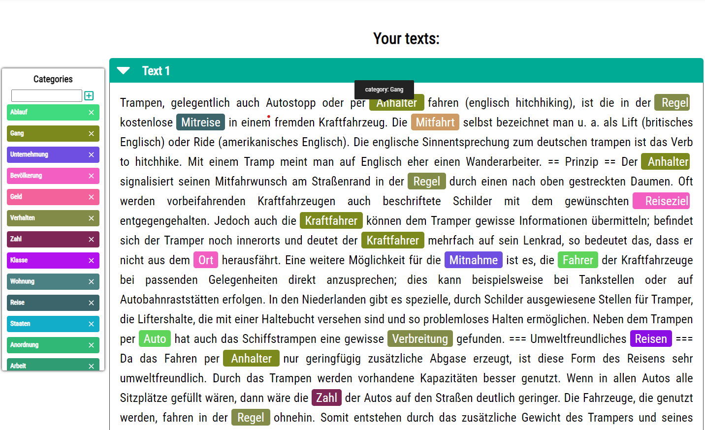
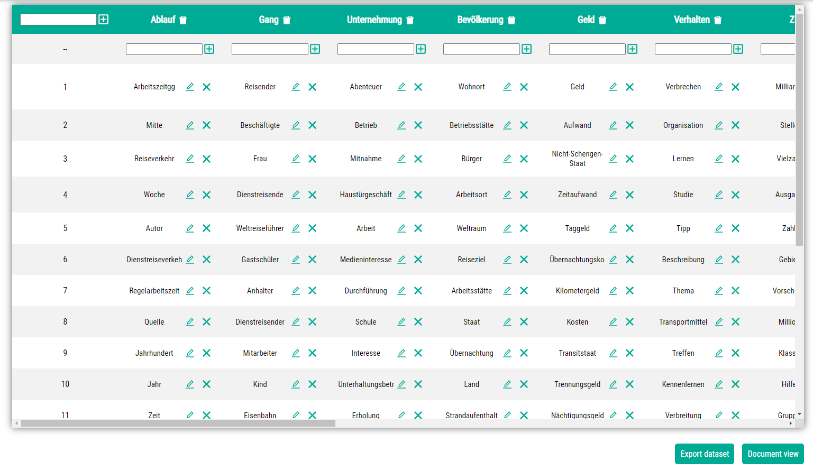

# Annotation Tool for Creating Domain-specific Text Datasets

## Project description
This project is a user friendly tool that helps annotate texts, modify or creat NER datasets.
The tool is able to annotate text either from scratch or based on an already existing dataset.
It takes as input texts and the datasets (if any) as JSON files.

The project was developed using ReactJs 

## Run localy
The project was made using reactJs so to run or continue developping the project the normal react commands are used.

In the project directory, you can run:

### `npm start` 

Runs the app in the development mode.\
Open [http://localhost:3000](http://localhost:3000) to view it in the browser.

The page will reload if you make edits.\
You will also see any lint errors in the console.

### `npm test`

Launches the test runner in the interactive watch mode.\
See the section about [running tests](https://facebook.github.io/create-react-app/docs/running-tests) for more information.

### `npm run build`

## Application inputs

The application accepts as inputs only JSON files with a specific format

#### Texts input
The data structure for the texts file should be as follows:

    [
    "text 1",
    "text2",
    "text3",
    "..."
    ]

#### Datasets input
In case there is a dataset containing pre-annotated terms/labels, it can be imported with the following structure:

    { 
    "category name": [array of values],
    "category name": [array of values],
    }

#### Data interaction within the App

In the app background, there is some react states that hold the data for the entire app. Like a centralized data source.

The following scheme shows how does the data is interlinked in the app.

## How to use the Application

### Data loading:
After clicking "get started" on the home screen, a new page appears with a single button to upload the text(s) to be annotated.

After the text(s) is loaded another page appears to choose a dataset if available, otherwise the user can just annotate their text(s) from scratch.

### Document view
The document view shows the annotated text in the middle with the control panels on the sides

+Left control panel:
    It's a panel used to add/delete the categories 

+Right control panel:
    It's a panel used to manipulate the terms selected (a non-annotated term could be selected by a normal text selection, while a pre-annotated term gets selected by a simple click on it). After selecting a term, the buttons on the right panel get enabled to add/delete or modify the term.

+Text container:
    Container containing the text annotated 

+page bottom:
    At the bottom the user can find two buttons to export their new annotated dataset, or switch the grid view, which we will be discussing next.

### Table view 

The table/Grid view makes it possible to visualize the dataset modified by the user in a table, that supports all the manipulations possible in the document view, which means from within the table it's possible to delete/add or modify a term or it's Category.

+delete Category:
    it is possible to delete a category by clicking the delete button next to each category name.

+Add category:
    it is possible to add a category by filling the text field in the top left of the table, then pressing enter or the plus button.

The same concepts could be used to add, delete or modify a value within the table.

Again, the two buttons at the end of the page are used to export the dataset or to switch to the other view.

